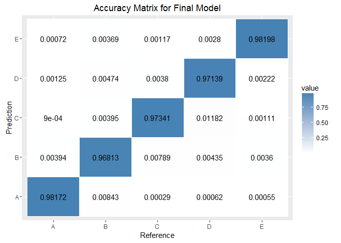

# Practical Machine Learning Course Project
Guillermo Pachón  
November 10, 2016  


## 1. Summary

### 1.1 Background

Using devices such as *Jawbone Up*, *Nike FuelBand*, and *Fitbit* it is now possible to collect a large amount of data about personal activity relatively inexpensively. These type of devices are part of the quantified self movement – a group of enthusiasts who take measurements about themselves regularly to improve their health, to find patterns in their behavior, or because they are tech geeks. One thing that people regularly do is quantify how *much* of a particular activity they do, but they rarely quantify *how well they do it*. In this project, my goal will be to use data from accelerometers on the belt, forearm, arm, and dumbell of 6 participants. They were asked to perform barbell lifts correctly and incorrectly in 5 different ways.

More information is available from the website here: http://groupware.les.inf.puc-rio.br/har (see the section on the Weight Lifting Exercise Dataset).

### 1.2 Data

The training data for this project are available here:

https://d396qusza40orc.cloudfront.net/predmachlearn/pml-training.csv

The test data are available here:

https://d396qusza40orc.cloudfront.net/predmachlearn/pml-testing.csv

The data for this project come from Groupware Technologies - Human Activity Recognition, Weight Lifting Exercises Dataset: http://groupware.les.inf.puc-rio.br/har

### 1.3 Project

The goal of this project is to predict the manner in which they did the exercise. This is the "classe" variable in the training set. I may use any of the other variables to predict with.

The following report will describe how built the model, how used cross validation, what think the expected out of sample error is, and why I made the choices I did. I will also use the prediction model to predict 20 different test cases.

## Exploring the Data

We need to load required packages and set parallel options for improved performance.


```r
# Required packages
library(RCurl); library(caret); library(relaxo); library(parallel); library(doParallel); library(reshape2);

# Set parallel options
cluster <- makeCluster(detectCores() - 1) # Leave 1 for OS
registerDoParallel(cluster)
```

Load the data from the provided files. 


```r
training <- read.csv(file="pml-training.csv", na.strings = c("NA", "#DIV/0!"))
testing <- read.csv(file="pml-testing.csv", na.strings = c("NA", "#DIV/0!"))

paste("TRAINING: Rows: ", dim(training)[1], ". Columns: ", dim(training)[2], ".", sep = "")
```

```
## [1] "TRAINING: Rows: 19622. Columns: 160."
```

Now we will do some exploration and make some analisys. Using the information in *training* we will create the training and test data to test some prediction methods.

But, before the analisys, some cleaning work sholud be made in training data. Several columns contains only NA values making nearly imposible to validate the methods with the training data as is. We will:

* Remove covariates with more than 80% missing values.
* Remove de idetification columns from the data.


```r
# Columns contains only NA values, so that columns will be removed
training.mNA <- sapply(colnames(training), function(x) if(sum(is.na(training[, x])) > 0.8*nrow(training)){return(T)}else{return(F)})
training <- training[, !training.mNA]

#Remove identification columns
trainingNI <- training[, -(1:5)]

# Create partitions for train and test
set.seed(83538)
inTrain <- createDataPartition(trainingNI[,1], p = 0.5, list = FALSE)
trainDF <- trainingNI[inTrain,]
testDF <- trainingNI[-inTrain,]
```

## Fitting Models

To make an automated analisys, create a function to test some methods and try to identify the one that gets best results (Accuracy). 


```r
# Function testModel return the Accuracy from the confusionMatrix.
testModel <- function(tr, ts, m = "lm", usePCA = FALSE) {
  preProc = NULL;
  mFit = NULL;
  if (usePCA) { preProc = "pca" }
  if (m == "rf") {
    mFit <- train(classe ~ ., method = m, data = tr, preProcess = preProc, trControl = fitControl, ntree = 10)
  }
  else {
    mFit <- train(classe ~ ., method = m, data = tr, preProcess = preProc, trControl = fitControl)
  }
  cMat <- confusionMatrix(ts$classe, predict(mFit, newdata = ts))
  Accuracy = round(cMat$overall[[1]], 6)
  Accuracy
}
```

In all cases, test the classifier with 10-fold cross-validation.


```r
fitControl <- trainControl(method = "cv", number = 10, allowParallel = TRUE)
```

Test the following models:

* CART
* Random Forest
* Stochastic Gradient Boosting
* Naive Bayes

For every method tested, the testModel funcion is called, first without and then with a Principal Components Analisys.


From the analisys we get the following numbers:


```
##   Method Accuracy   PCA
## 1  rpart 0.500255 FALSE
## 2     rf 0.992152 FALSE
## 3    gbm 0.983488 FALSE
## 4     nb 0.758231 FALSE
## 5  rpart 0.370808  TRUE
## 6     rf 0.927021  TRUE
## 7    gbm 0.810213  TRUE
## 8     nb  0.65131  TRUE
```

## Model Selection

From the model analisys we get that the best method to estimate the outcome is Random Forest (Accuracy: 0.99276) or Stochastic Gradient Boosting (Accuracy: 0.98359) so we will continue with **Random Forest**. For the test, this is de model:


```r
mFit <- train(classe ~ ., method = "rf", data = trainingNI, trControl = fitControl, ntree = 10)
# De-register parallel processing cluster
stopCluster(cluster)

# final model
summary(mFit$finalModel)
```

```
##                 Length Class      Mode     
## call                5  -none-     call     
## type                1  -none-     character
## predicted       19622  factor     numeric  
## err.rate           60  -none-     numeric  
## confusion          30  -none-     numeric  
## votes           98110  matrix     numeric  
## oob.times       19622  -none-     numeric  
## classes             5  -none-     character
## importance         54  -none-     numeric  
## importanceSD        0  -none-     NULL     
## localImportance     0  -none-     NULL     
## proximity           0  -none-     NULL     
## ntree               1  -none-     numeric  
## mtry                1  -none-     numeric  
## forest             14  -none-     list     
## y               19622  factor     numeric  
## test                0  -none-     NULL     
## inbag               0  -none-     NULL     
## xNames             54  -none-     character
## problemType         1  -none-     character
## tuneValue           1  data.frame list     
## obsLevels           5  -none-     character
```

The final random forests model uses *classification*, uses 10 trees with 28 variables tried at each split and the estimated out of sample error rate is 1.3% as reported.


```r
# Set confusion matrix as data.frame
confMat <- data.frame(as.table(mFit$finalModel$confusion[(1:5), (1:5)] / summary(trainingNI$classe)))
colnames(confMat) <- c("Reference", "Prediction", "value")

# Plot Confusion matrix
g <- ggplot(confMat, aes(Reference, Prediction)) + labs(title = "Accuracy Matrix for Final Model")
g <- g + geom_tile(aes(fill = value), colour = "white")
g <- g + geom_text(aes(label= ifelse(value == 0, "", round(value, 5))), color = "black", size = 4)
g <- g + scale_fill_gradient(low = "white", high = "steelblue")
g
```

<!-- -->

## Prediction

Now, after verifiying the performance of the model selected, predict the *classe* for the **training** data.


```r
# prediction
prediction <- predict(mFit, testing)
```

So, the predicted 20 *classe* values por **testing** are: ``B, A, B, A, A, E, D, B, A, A, B, C, B, A, E, E, A, B, B, B``.

## Conclussions

* We use Random Forests as prediction method with 10-fold cross-validation. This method give us a 0.99276 Accuracy.

* The final random forests model contains 10 trees with 28 variables tried at each split.

* Estimated out of sample error rate for the random forests model is 1.3% as reported by the final model.

---
